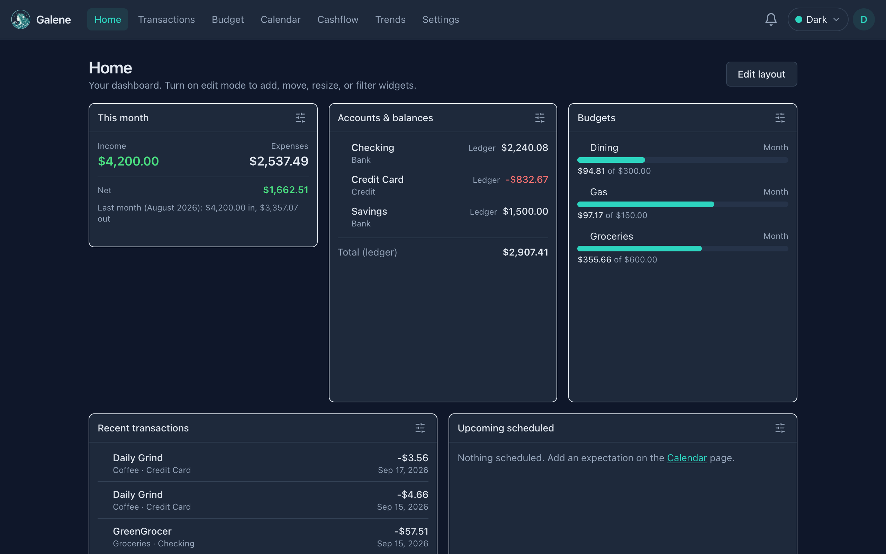
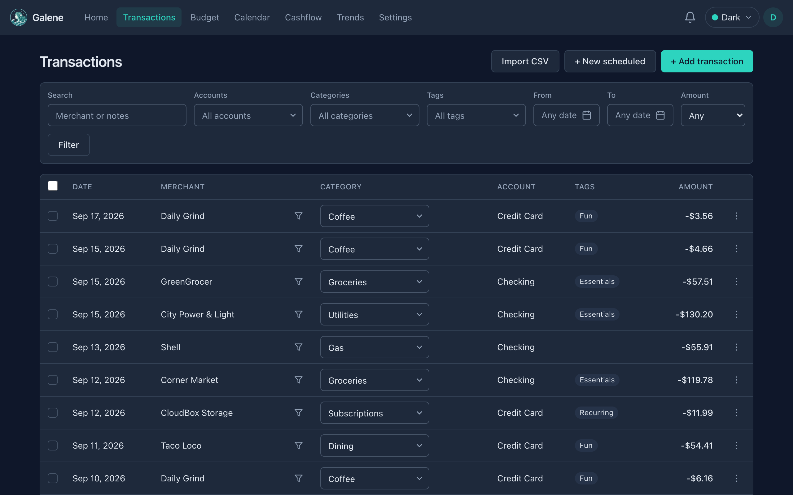
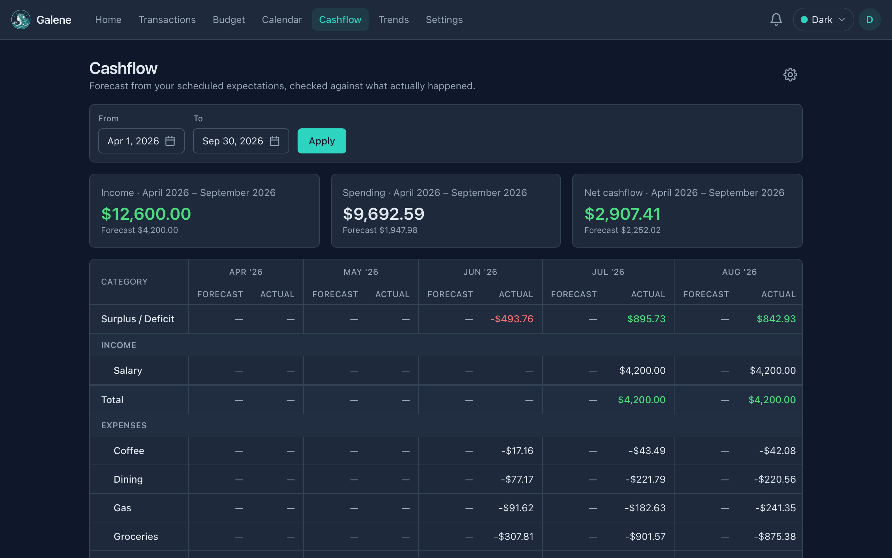
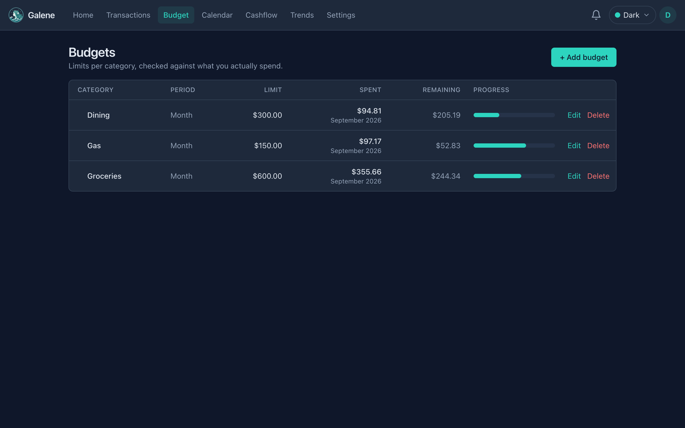
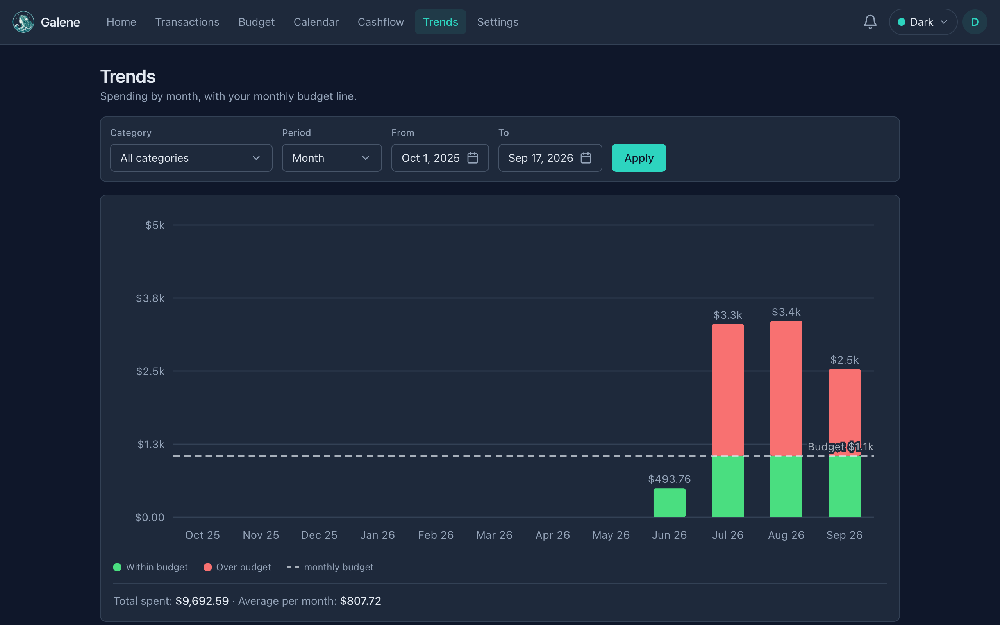

<p align="center">
  
</p>

<p align="center"><em>Calm seas. Clear books.</em></p>

<p align="center">
  <a href="https://docs.galene.finance/">Docs</a>
  ·
  <a href="https://github.com/galene-finance/galene/releases">Releases</a>
  ·
  <a href="https://github.com/galene-finance/galene/issues/new/choose">Submit an issue</a>
  ·
  <a href="https://github.com/galene-finance/galene/discussions">Discussions</a>
  ·
  <a href="https://buymeacoffee.com/galene">Donate</a>
</p>

## What Galene is

Galene is a self-hostable personal finance app. You connect bank accounts (or enter them by hand), categorize and tag transactions, set budgets, and watch cashflow and trends.

It values **privacy by default** (your SQLite database on your host), **clarity over clutter**, and **features you can verify**: opening balances, transfer categories that stay out of income/expense reports, optional TOTP, backups, and a read-only API/MCP for scripts and assistants.

**Highlights:** multi-account transactions · budgets & calendar expectations · cashflow & trends · SimpleFIN / Plaid / demo sync · per-user settings and admin tools · Docker/Podman or from-source installs.

## Getting started

Install Galene on your own machine or server, create the first admin account, then (optionally) load demo data or connect a bank.

| Path | Start here |
| --- | --- |
| From source (bun) | [From source](https://docs.galene.finance/self-host/from-source/) |
| Docker Compose | [Docker & Compose](https://docs.galene.finance/self-host/docker/) |
| Podman | [Podman (compose & quadlets)](https://docs.galene.finance/self-host/podman/) |
| TLS / reverse proxy | [Reverse proxy](https://docs.galene.finance/self-host/reverse-proxy/) |
| Backups | [Backups](https://docs.galene.finance/self-host/backups/) |

Full operator and feature guides: **[docs.galene.finance](https://docs.galene.finance/)**. Container deploy checklist also lives in [`DEPLOY.md`](DEPLOY.md).

Quick local preview:

```bash
bun install
bun run dev
```


## Screenshots

Dark theme, demo data:

| Home | Transactions | Cashflow |
| :---: | :---: | :---: |
|  |  |  |

| Budget | Trends |
| :---: | :---: |
|  |  |

## Stack

- **Svelte 5** (runes) + **SvelteKit** + **TypeScript**
- **bun** (required — uses `bun:sqlite`)
- **SQLite** (WAL, single file)
- **Tailwind CSS 4** + **Bits UI v2**

## Versioning

**major.minor** version in [`package.json`](package.json) (e.g. `0.1`, tagged `v0.1`). Shown in Settings → About, `GET /version`, and OCI image labels. See [`CHANGELOG.md`](CHANGELOG.md) and GitHub Releases.

## License

Licensed under the **GNU Affero General Public License v3.0 (AGPL-3.0)**.
